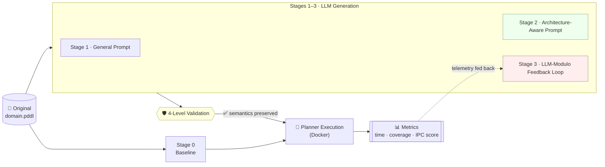

<div align="center">

# 🧩 ArchAware‑PDDL‑Configurator

### Architecture‑Aware Domain Model Configuration
**Leveraging LLMs and Feedback Loops for AI Planner‑Specific Optimization**

*Can a Large Language Model rewrite the **text** of a planning domain — without touching its meaning — so that a specific planner solves it faster? And does knowing **how that planner thinks** make the difference?*

<br/>

[](https://www.python.org/)
[](https://www.docker.com/)
[](https://planning.wiki/guide/whatis/pddl)
[](https://github.com/latextemplates/scientific-thesis-template)
[](LICENSE)

[](docs/planners.md)
[](docs/llms.md)
[](docs/domains.md)
[](docs/planner-runs.md)

<br/>

<p><strong>Bachelor's Thesis</strong> &nbsp;·&nbsp; <a href="https://www.uni-stuttgart.de/en/">University of Stuttgart</a> &nbsp;·&nbsp; <a href="https://www.iaas.uni-stuttgart.de/en/department-service-computing/">IAAS — Service Computing</a></p>

<p><strong>Author:</strong> Daniel Ehab Rasmy Bendas</p>
<p><strong>Supervisor &amp; Examiner:</strong> <a href="https://www.iaas.uni-stuttgart.de/en/institute/team/Georgievski/">Dr. Ilche Georgievski</a></p>

</div>

---

> [!NOTE]
> **TL;DR** — Modern planners are *structurally sensitive*: the order in which a `domain.pddl` lists its predicates, actions, preconditions, and effects can change solve time by orders of magnitude — **with zero change to the logic**. This project has four frontier LLMs reorder domains for a **specific target planner**, briefing each model on that planner's **internal architecture**. A four‑level validator guarantees the meaning is never altered, and an **LLM‑Modulo feedback loop** lets the model learn from real execution results.

> [!TIP]
> 📖 **The full thesis** — background, methodology, experiments, statistics, and results — will be linked here once it is published in the University of Stuttgart library. *(Link coming soon.)* The LaTeX source lives in [`thesis_document/`](thesis_document/).

---

## 🎯 What Is This?

Domain‑independent planners read a problem from a **PDDL** domain file. A well‑documented quirk of these planners is **structural sensitivity**: reordering the predicates, actions, preconditions, and effects in that file — *with no change whatsoever to its logic* — can change how fast a planner solves the task, sometimes by orders of magnitude. A reordering that helps one planner can hurt another.

This project turns that quirk into an **automated optimization**. It asks four frontier LLMs to reorder a domain for a **specific target planner**, using prompts that describe that planner's **internal architecture** (how it grounds, searches, and applies heuristics). A four‑level validator guarantees the meaning is never changed, and an **LLM‑Modulo feedback loop** feeds real execution results back to the model so it can refine its reordering over several iterations — all without editing a single line of planner source code.

The repository holds the complete pipeline, the four containerised planners, the five benchmark domains, and every result and log. It evaluates **4 planners** (BFWS · LAMA · DecStar · Madagascar) × **4 LLMs** (GPT‑5.4 · DeepSeek‑R1 · Claude Opus 4.6 · Gemini 3.1 Pro) × **5 IPC domains** × **15 instances**.

> This README is a practical guide to the **code and how to run it**. The scientific side — methodology, experiments, and results — lives in the thesis (linked above).

---

## 🏗️ How It Works

Every domain flows through four progressive stages. **Stage 0** is the baseline; **Stages 1–3** each add one ingredient, so the value of that ingredient can be isolated.



**The four configuration stages** *(each a folder under [`experiments/`](experiments/))*:

| Stage | What it adds |
|---|---|
| **0 · Baseline** — [`experiments/base/`](experiments/base/) | Runs the planners on the original, unmodified domains. |
| **1 · General Prompt** — [`experiments/general-prompt/`](experiments/general-prompt/) | A planner‑agnostic "reorder for efficiency" prompt. |
| **2 · Architecture‑Aware Prompt** — [`experiments/arch-aware/`](experiments/arch-aware/) | A planner‑specific prompt encoding each engine's internals. |
| **3 · Feedback Loop** — [`experiments/feedback-loop/`](experiments/feedback-loop/) | Iterative refinement driven by real execution telemetry. |

**The four‑level validation pipeline** guards every generated domain before it reaches a planner *(see [`validation_and_evaluation/scripts/validation/`](validation_and_evaluation/scripts/validation/))*:

1. **V1 · Extraction** — pull a clean `(define …)` block out of the LLM response.
2. **V2 · Syntactic** — validate it with the **VAL** tool.
3. **V3 · Identity** — reject unchanged copy‑paste returns.
4. **V4 · Semantic** — prove the meaning is preserved via component set‑equality.

> *Full methodology, prompt design, and experimental results are in the thesis.*

---

## 📁 Repository Structure

```
ArchAware-PDDL-Configurator/
│
├── experiments/                  # ⭐ The pipeline — one folder per stage
│   ├── base/                     #   Stage 0 · baseline harness (run_stage0.py)
│   ├── general-prompt/           #   Stage 1 · generic prompt   (run_stage1.py)
│   ├── arch-aware/               #   Stage 2 · arch-aware prompt (run_stage2.py)
│   │   └── prompts/              #     the 4 planner-specific prompts
│   └── feedback-loop/            #   Stage 3 · LLM-Modulo loop   (run_stage3.py)
│
├── validation_and_evaluation/    # 🛡️ The V1–V4 validation pipeline + tests
├── planners/                     # 🐳 Dockerised planners (bfws · decstar · lama · madagascar · VAL)
├── benchmarks/                   # 🗺️ The 5 IPC domains (domain.pddl + instances)
│
├── results/                      # 📊 Result CSVs + every generated domain
├── logs/                         # 🧾 Full per-run logs
├── analysis/                     # 🔬 Analysis scripts (run_all.py) + output/
│
├── thesis_document/              # 📖 The LaTeX thesis source
├── config/experiment_config.yaml # ⚙️ Single source of truth for all parameters
├── requirements.txt              # 🐍 Python dependencies
└── .env                          # 🔑 API keys (git-ignored — create your own)
```

---

## 🚀 Getting Started

### Prerequisites
- **Python ≥ 3.10**
- **Docker** (the four planners + VAL each run in isolated containers)
- API keys for the four LLM providers — only needed to *regenerate* Stages 1–3. The committed results and logs let you re‑run the **analysis** with no keys and no Docker.

### 1 · Install dependencies
```bash
pip install -r requirements.txt
```

### 2 · Add your API keys
Create a `.env` file in the project root (it is git‑ignored):
```dotenv
OPENAI_API_KEY=sk-...
ANTHROPIC_API_KEY=sk-ant-...
GEMINI_API_KEY=...
DEEPSEEK_API_KEY=...
```

### 3 · Build the planner containers
```bash
docker build --build-arg CACHEBUST=4 -t lama_planner       -f planners/lama/Dockerfile .
docker build --build-arg CACHEBUST=4 -t madagascar_planner -f planners/madagascar/Dockerfile .
docker build --build-arg CACHEBUST=4 -t bfws_planner       -f planners/bfws/Dockerfile .
docker build --build-arg CACHEBUST=4 -t decstar_planner    -f planners/decstar/Dockerfile .

# VAL validator (used by validation level V2)
docker build -t val_validator:latest -f planners/validity/Dockerfile .
```

### 4 · Run the pipeline
Each stage is **checkpointed** — safe to interrupt (Ctrl‑C) and restart; completed runs are skipped.
```bash
python3 -m experiments.base.run_stage0            # Stage 0 · Baseline
python3 experiments/general-prompt/run_stage1.py  # Stage 1 · General prompt
python3 experiments/arch-aware/run_stage2.py      # Stage 2 · Architecture-aware prompt
python3 experiments/feedback-loop/run_stage3.py   # Stage 3 · Feedback loop
```

### 5 · Reproduce the analysis (no keys or Docker needed)
```bash
python3 analysis/run_all.py                       # regenerates everything under analysis/output/
```

Every parameter — seeds, domains, planners, model IDs, Docker limits — is centralised in [`config/experiment_config.yaml`](config/experiment_config.yaml).

---

## 🧰 Tech Stack

| Layer | Tools |
|---|---|
| **LLM access** | `openai` · `anthropic` · `google-generativeai` (GPT‑5.4, Claude Opus 4.6, Gemini 3.1 Pro, DeepSeek‑R1) |
| **Orchestration** | Python 3.10+ · `PyYAML` · `python-dotenv` · `tenacity` · `tqdm` |
| **Planner isolation** | Docker (Fast Downward · LAPKT/BFWS · DecStar · Madagascar · VAL) |
| **Data & stats** | `pandas` · `numpy` · `scipy` · `statsmodels` · `scikit-posthocs` |
| **Visualisation** | `matplotlib` · `seaborn` |

---

## 📖 Thesis & Citation

The full LaTeX source is in [`thesis_document/`](thesis_document/); a public link to the published thesis will be added here once it is available in the University of Stuttgart library.

```bibtex
@thesis{Bendas2026ArchAware,
  author = {Daniel Ehab Rasmy Bendas},
  title  = {Architecture-Aware Domain Model Configuration:
            Leveraging LLMs and Feedback Loops for AI Planner-Specific Optimization},
  school = {University of Stuttgart, Institute of Architecture of Application Systems (IAAS)},
  type   = {Bachelor's Thesis},
  year   = {2026},
  note   = {Supervisor \& Examiner: Dr.\ Ilche Georgievski}
}
```

---

## 📜 License

Released under the **MIT License** — code, prompts, domain configurations, and analysis scripts are free to reuse.

## 🙏 Acknowledgements

- [**Dr. Ilche Georgievski**](https://www.iaas.uni-stuttgart.de/en/institute/team/Georgievski/) (IAAS, University of Stuttgart) — supervision and examination.
- The maintainers of **Fast Downward**, **LAPKT / BFWS**, **DecStar**, **Madagascar**, and **VAL**, and the **International Planning Competition** community for the benchmark domains.
