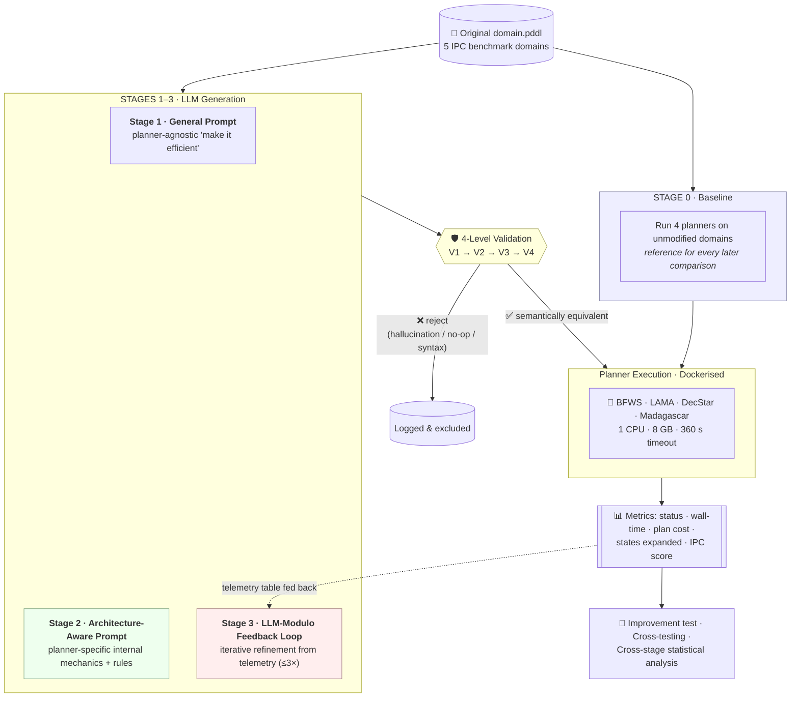
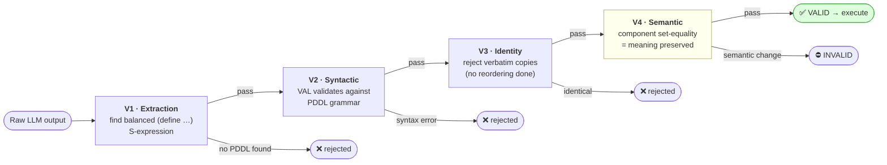

<div align="center">

# 🧩 ArchAware‑PDDL‑Configurator

### Architecture‑Aware Domain Model Configuration
**Leveraging LLMs and Feedback Loops for AI Planner‑Specific Optimization**

*Can a Large Language Model rewrite the **text** of a planning domain — without touching its meaning — so that a specific planner solves it faster? And does knowing **how that planner thinks** make the difference?*

<br/>


<br/>

**Bachelor Thesis · University of Stuttgart · Institute of Architecture of Application Systems (IAAS)**
Author: **Daniel Ehab Rasmy Bendas** · Supervisor & Examiner: **Dr. Ilche Georgievski**

</div>

---

> [!NOTE]
> **TL;DR** — Modern planners are *structurally sensitive*: the order in which a `domain.pddl` lists its predicates, actions, preconditions, and effects can change solve time by orders of magnitude — **with zero change to the logic**. This project asks four frontier LLMs to reorder domains, but with a twist: instead of generic "make it efficient" prompts, each LLM is briefed on the **internal architecture** of the *target* planner. A four‑level validator guarantees semantics are never altered, and an **LLM‑Modulo feedback loop** feeds real execution telemetry back to the model for iterative refinement. The result: the share of configurations that beat the unmodified baseline climbs from **44.1% → 80.9%**, and — remarkably — once architecture‑awareness is switched on, **which LLM you use stops mattering statistically**.

---

## 📑 Table of Contents

1. [Overview — The Problem & The Idea](#-overview--the-problem--the-idea)
2. [Headline Results](#-headline-results)
3. [Research Questions & Answers](#-research-questions--answers)
4. [How It Works — The Four‑Stage Pipeline](#️-how-it-works--the-four-stage-pipeline)
5. [The Four‑Level Validation Pipeline](#️-the-four-level-validation-pipeline)
6. [The Experimental Matrix](#-the-experimental-matrix)
7. [Results in Depth](#-results-in-depth)
8. [Repository Structure](#-repository-structure)
9. [Getting Started](#-getting-started)
10. [Reproducibility](#-reproducibility)
11. [Data & Artifacts](#️-data--artifacts)
12. [Tech Stack](#-tech-stack)
13. [Relation to Prior Work](#-relation-to-prior-work)
14. [Limitations & Future Work](#️-limitations--future-work)
15. [Thesis & Citation](#-thesis--citation)
16. [License & Acknowledgements](#-license)

---

## 🎯 Overview — The Problem & The Idea

Automated planning gives a single, domain‑independent planner the ability to solve problems across robotics, logistics, cloud orchestration, and more — as long as the world is described declaratively in the **Planning Domain Definition Language (PDDL)**. That modularity is the field's superpower, but it hides a subtle catch discovered decades ago and made rigorous by Vallati et al.:

> **Structural sensitivity.** Two `domain.pddl` files that are *logically identical* — same predicates, same actions, same preconditions and effects — but written in a **different textual order** can cause **orders‑of‑magnitude** differences in planner runtime and coverage. Worse, a reordering that speeds up one planner can *slow down* another.

Historically, optimising this textual structure has been a manual, trial‑and‑error craft requiring deep knowledge of planner internals. Recent LLM‑based approaches automate the rewriting, but they share three gaps this thesis targets:

| Gap in prior work | What this project does about it |
|---|---|
| ❌ **Planner‑agnostic prompts** — generic "reorder for efficiency" instructions that ignore the target engine | ✅ **Architecture‑aware prompts** that encode each planner's internal pipeline (grounding, heuristics, search) and derive planner‑specific reordering rules |
| ❌ **Single forward pass** — no learning from what actually happened at runtime | ✅ An **LLM‑Modulo feedback loop** that feeds per‑instance execution telemetry back to the model for up to 3 iterations |
| ❌ **Weak safety** — risk of silently changing the domain's meaning | ✅ A **four‑level validation pipeline** that mathematically guarantees semantic equivalence before any domain reaches a planner |

**The central hypothesis:** because different planner architectures read a domain through fundamentally different algorithmic pipelines, *architecture‑aware* prompting combined with iterative execution feedback lets an LLM produce configurations **specifically optimised for a given target planner** — and simultaneously reveals which architectures are inherently **resilient** to reordering and therefore not worth configuring at all.

---

## ✨ Headline Results

<div align="center">

| 📈 Metric | Result |
|---|---:|
| Configurations beating the unmodified baseline | **44.1% → 80.9%** (one‑shot → +feedback) |
| Architecture‑aware gain vs. generic gain | **≈ 2×** (nearly double) |
| Stage‑2 generation failures recovered by the loop | **5 / 5 (100%)** |
| Population‑level solve rate across feedback iterations | **56.9% → 69.0%** |
| Solvable benchmark cells won by an LLM configuration | **180 / 183 (98.4%)** |
| Overall validation validity rate (all LLM stages) | **93%** |
| Stage effect (Friedman omnibus) | **χ² = 267.06, p ≈ 1.3 × 10⁻⁵⁷** |
| Arch‑aware **>** generic (Wilcoxon) | **p = 2.2 × 10⁻²¹** |
| Total planner executions collected | **7,350** |

</div>

Two findings stand out beyond the numbers:

- 🏛️ **Planner architecture governs configurability.** Order‑sensitive heuristic searchers (**BFWS**, **LAMA**) reward reordering and gain steadily across the pipeline; a decoupled‑search planner (**DecStar**) and a SAT‑based planner (**Madagascar**) largely *neutralise* the very orderings the LLM manipulates. The methodology **widens** this gap rather than closing it — the planner effect on IPC gain strengthens monotonically ($H = 26.6 \rightarrow 39.9 \rightarrow 76.7$).
- 🧑‍🔬 **Methodology outweighs model choice.** Under a *generic* prompt, the choice of LLM is a strong, statistically significant driver of quality ($p = 1.4 \times 10^{-5}$). Under the *architecture‑aware* prompt and the feedback loop, that same factor becomes **statistically non‑significant** ($p = 0.65$ and $p = 0.18$). The leverage lives in the *prompt engineering and feedback design*, not in privileged access to any one frontier model — so the approach is portable across vendors and model generations.

---

## 🧠 Research Questions & Answers

The thesis is organised around one **Main Research Question** — *"To what extent can LLMs dynamically optimise the structural configuration of PDDL domain models for distinct planner architectures, using targeted prompting, iterative execution feedback, and comparative analysis?"* — decomposed into five sub‑questions:

<details>
<summary><b>SQ1 — What are the internal architecture models of state‑of‑the‑art planners?</b></summary>

A component‑level analysis of BFWS, LAMA, DecStar, and Madagascar identified the modules common to modern planners (parser · translator/grounder · search engine · heuristic evaluator) and traced how the textual ordering of PDDL elements propagates through each. This produced **four planner‑specific rule sets** — turning informal folklore about "planner‑friendly" modelling into explicit, traceable heuristics that become the substance of the Stage‑2 prompts.
</details>

<details>
<summary><b>SQ2 — Can LLMs apply targeted transformations when told the planner's mechanics?</b></summary>

Yes, reliably. Predicate reordering rises from **22%** of domains under the generic prompt to **100%** under the architecture‑aware prompt, and the share of configurations that improve their target planner climbs to **56.0%**. The improvements are **target‑biased**: **81.0%** carry a positive specialisation index (mean $+0.0313$).
</details>

<details>
<summary><b>SQ3 — Does an LLM‑Modulo feedback loop help?</b></summary>

The three‑iteration loop raises the baseline‑relative improvement rate from **44.1% → 80.9%**, recovers **every** Stage‑2 generation failure, and drives a monotonic rise in population solve rate (**56.9% → 69.0%**). Its contribution is **breadth and reliability** rather than a higher aggregate ceiling.
</details>

<details>
<summary><b>SQ4 — Can automated validation prevent semantic hallucination during multi‑turn refinement?</b></summary>

Across all LLM stages the four‑level pipeline sustains a **93%** validity rate and rejects **every** semantically altered domain before it reaches a planner. Even as prompts lengthen in the feedback loop, the hard‑critic gate caught all **17** invalid Stage‑3 iterations — **not one** performance measurement in the entire study is contaminated by a change of meaning.
</details>

<details>
<summary><b>SQ5 — How do different architectures respond to structural variation?</b></summary>

Responsiveness is ordered **BFWS > LAMA > Madagascar > DecStar** under every metric, and the pipeline *amplifies* the differences. Order‑driven forward searchers reward reordering; a planner that factors ordering away (DecStar) or compiles it into SAT variables its solver re‑orders (Madagascar) resists it. The resulting mapping is **actionable**: promote goal‑relevant and static predicates to accelerate mutex/landmark discovery for forward search — and expect little from architectures that abstract textual order away.
</details>

> **Bottom line:** LLMs *can* dynamically optimise PDDL structure for distinct planner architectures, and they do so most effectively when guided by architecture‑specific knowledge and iterative execution feedback — a consistent, semantics‑preserving gain achieved **without touching a single line of planner source code**.

---

## 🏗️ How It Works — The Four‑Stage Pipeline

Every domain flows through an ablation of four progressive stages. **Stage 0** establishes the baseline; **Stages 1–3** each add one ingredient so the incremental value of that ingredient can be isolated.



| Stage | Name | What's added | Key question |
|:--:|---|---|---|
| **0** | Baseline | — | How do planners perform on the *unmodified* domains? |
| **1** | General Prompt | Planner‑agnostic LLM reordering | Does generic reordering, on its own, move performance? *(Answer: a controlled null result.)* |
| **2** | Architecture‑Aware Prompt | Planner‑specific internal‑mechanics briefing + rules | Does naming the target planner yield **targeted** improvements? *(Answer: yes — the thesis's core positive finding.)* |
| **3** | LLM‑Modulo Feedback Loop | Per‑instance execution telemetry fed back for ≤3 iterations | Can real feedback push past the one‑shot ceiling? *(Answer: it doubles reliability & recovers every failure.)* |

**What the LLM actually sees in Stage 2** — a briefing tailored to each engine. For example, the BFWS prompt explains its *direct‑memory‑injection parsing*, *bucket sorting* (`partition = 1000·#g + #r`), *novelty evaluation*, and *two‑engine relay*, then derives concrete rules like *"place goal‑achieving actions first so they receive the lowest internal IDs, changing tie‑breaking in the `H_Add_Rp_Fwd` heuristic."* The LAMA prompt instead talks about *mutex discovery*, *landmarks*, and *preferred‑operator queues*. Same task, four fundamentally different rulebooks. *(Full prompts live in `experiments/arch-aware/prompts/` and in the thesis appendix.)*

**Stage 3's feedback** is a per‑instance telemetry table the model reads before revising — which instances solved, how fast, states expanded, IPC score and gain — plus a diagnostic ("Coverage decreased from 80% to 73%") and a suggested focus for the next iteration. The loop is a *generate → test → critique* cycle, and it visibly shifts the model from restating the prompt to adaptive self‑correction ("*I revert to the iteration‑1 approach but avoid the action reshuffle that regressed*").

---

## 🛡️ The Four‑Level Validation Pipeline

The safety net. Every LLM‑generated domain must pass **all four levels** — in order — before a single planner touches it. It extends the three‑stage validator of the prior work with a new **V1 extraction** stage, and its guarantee is the reason no efficiency number in the thesis is contaminated by a change of meaning.



| Level | Script | Guarantees |
|:--:|---|---|
| **V1** | [`v1_extraction.py`](validation_and_evaluation/scripts/validation/v1_extraction.py) | Pulls a clean `(define …)` block out of markdown fences, prose, or JSON via parenthesis balancing. |
| **V2** | [`v2_syntactic_validation.py`](validation_and_evaluation/scripts/validation/v2_syntactic_validation.py) | The **VAL** tool (KCL‑Planning, the IPC standard) confirms the domain is grammatically well‑formed against the first problem instance. |
| **V3** | [`v3_identity_check.py`](validation_and_evaluation/scripts/validation/v3_identity_check.py) | Rejects verbatim returns — a model that "did nothing" carries no configuration signal. |
| **V4** | [`v4_semantic_equivalence.py`](validation_and_evaluation/scripts/validation/v4_semantic_equivalence.py) | The crucial one. Parses both domains and compares each of **9 components as unordered sets**. For reordering‑only edits, semantic equivalence *reduces to set equality* — any added/removed/renamed predicate, altered precondition, or modified effect is caught. |

> 💡 **The key insight:** since PDDL treats predicates, actions, preconditions, and effects as order‑*independent* sets, two reordered domains are semantically equivalent **if and only if** their component sets are identical. V4 also records, per component, whether it was *reordered* vs. *semantically changed* — yielding 18 boolean flags per domain that power the "what did the LLM choose to reorder?" analysis.

---

## 🧪 The Experimental Matrix

The core grid is **4 planners × 4 LLMs × 5 domains × 15 instances**, all pinned in a single [`config/experiment_config.yaml`](config/experiment_config.yaml) for full reproducibility.

### 🐳 Planners — four *fundamentally different* search paradigms
Selected from an initial pool of 35 via a four‑step filter (agile & non‑portfolio → proven track record → reproducible/Dockerisable → **distinct architectures**). This last filter is critical: most top IPC planners are Fast Downward variants, so picking "the top 4" would test one architecture four times.

| Planner | Paradigm | Why it's here | Responds to reordering? |
|---|---|---|:--:|
| **LAMA‑first** (Fast Downward) | Heuristic forward search (FF + landmarks) | Gold‑standard baseline; official IPC 2023 Agile baseline | 🟢 Strongly |
| **LAPKT‑BFWS‑Preference** | Width‑based search (novelty) | IPC 2018 Agile winner; explores *structurally novel* states | 🟢 Strongly |
| **DecStar** | Decoupled search (star topology) | IPC 2023 Agile winner; factors domain into independent leaves | 🔴 Resists |
| **Madagascar** (MpC) | SAT‑based (compilation) | Translates the task into Boolean formulae per plan length | 🟡 Resists reordering, gains coverage |

### 🤖 LLMs — two architectural families
Version‑pinned endpoints, `temperature = 0.0` (deterministic), stateless calls.

| Model | Provider | Category |
|---|---|---|
| **GPT‑5.4** | OpenAI | Deep‑reasoning |
| **DeepSeek‑R1** | DeepSeek | Deep‑reasoning |
| **Claude Opus 4.6** | Anthropic | Coding heavyweight |
| **Gemini 3.1 Pro** | Google | Coding heavyweight |

### 🗺️ Domains — spanning the structural spectrum
Chosen to maximise structural diversity (action count $|A|$, predicates $|P|$, type depth $|O_t|$, max arity) across 25 years of IPC history.

| Domain | IPC | Niche | $\lvert A\rvert$ | $\lvert P\rvert$ | Max arity |
|---|:--:|---|:--:|:--:|:--:|
| **VisitAll** | 2014 | Minimal baseline — pure graph reachability | 1 | 3 | 2 |
| **Snake** | 2018 | Untyped, negative‑precondition, dead‑ends | 3 | 8 | 4 |
| **Ricochet Robots** | 2023 | Modern; action‑costs & numeric fluents | 4 | 6 | 4 |
| **Depots** | 2002 | Typed logistics; 3‑level type hierarchy | 5 | 6 | 4 |
| **Barman** | 2014 | Maximal complexity anchor | 12 | 15 | 6 |

Each domain ships **20 instances**; a fixed seed (`42`) selects the **15** evaluated everywhere: `[1, 2, 3, 4, 7, 8, 9, 11, 12, 13, 14, 16, 17, 18, 19]`. The same 15 across all planners, LLMs, and stages make every cross‑stage comparison **fully paired**.

---

## 📊 Results in Depth

### The four‑stage IPC progression
Re‑scored on one globally consistent reference time per instance (the IPC score is $1/(1+\log_{10}(T_i/T^{*}_i))$, ranging 0→1). The progression is **monotonic** — every stage adds value, though with diminishing marginal returns.

| Stage | Config. Sensitivity (IPC total) | Δ vs. S0 | What it proves |
|---|:--:|:--:|---|
| S0 · Baseline | 154.17 | — | reference |
| S1 · General | 157.93 | +3.76 | generic reordering is *marginal‑to‑harmful* |
| S2 · Arch‑Aware | 161.44 | **+7.27** | architecture‑awareness ≈ **doubles** the generic gain |
| S3 · Feedback | 163.87 | +9.70 | loop adds breadth & reliability |

### Where the best configuration comes from
Across all 300 (planner, domain, instance) cells, in a *simulated competition* against the global best:

```
Unsolvable by any config .............. 117  (39.0%)   ← structural floor
Baseline domain was best ...............  3  ( 1.0%)
Stage 1 (general prompt) ...............  14  ( 4.7%)
Stage 2 (arch-aware, on target) ........  52  (17.3%)
Stage 2 (cross-test, other planner) ....  46  (15.3%)   ← universal-transfer effect
Stage 3 (feedback loop) ................  68  (22.7%)
                                        ─────
LLM configs win 180 of 183 solvable cells (98.4%)
```

### Statistical validation
Because IPC scores are non‑normal (Shapiro–Wilk rejects normality everywhere), the entire suite is **rank‑based**: Friedman omnibus → Wilcoxon (Bonferroni‑corrected) → Nemenyi post‑hoc → Cliff's δ effect sizes → Kruskal–Wallis for factor effects.

- **Stage effect is real:** Friedman χ² = 267.06, **p ≈ 1.3 × 10⁻⁵⁷**.
- **Arch‑aware > generic:** Wilcoxon **p = 2.2 × 10⁻²¹**, Cliff's δ = 0.25.
- **Every configuration stage beats baseline** (all CIs exclude zero); the largest effect is S0 vs. S2, δ = 0.30.
- **The honest negative:** in the portfolio setting, Stage 3 is *statistically indistinguishable* from Stage 2 in aggregate IPC — the loop's value is reliability, not a higher ceiling. Reported as such.

> A consistent *small* effect (δ = 0.30) across four architecturally disparate planners, five heterogeneous domains, and four models — achieved without editing any planner — is, in domain‑independent planning, a **substantive** outcome, not a weak one.

---

## 📁 Repository Structure

> The repository is a complete research artifact: the pipeline code, the four containerised planners, every raw execution log, all result CSVs, the full analysis suite, and the LaTeX thesis. *(Some local‑only reference folders — prior‑work code, PDFs, private notes — are excluded via `.gitignore`.)*

```
ArchAware-PDDL-Configurator/
│
├── 📁 experiments/                  # ⭐ The pipeline — one folder per stage
│   ├── base/                        #   Stage 0 · baseline harness
│   │   ├── run_stage0.py            #     orchestrator (4 parallel planner threads)
│   │   ├── planner_runner.py        #     Docker exec + [METRIC]/[RESULT] parsing
│   │   ├── csv_manager.py           #     thread-safe CSV + O(1) checkpoint/resume
│   │   ├── heartbeat.py             #     60 s liveness logging
│   │   ├── error_handler.py         #     TIMEOUT/MEMOUT/FAILURE dumps + HALT logic
│   │   └── summary_generator.py     #     post-run summary
│   ├── general-prompt/              #   Stage 1 · generic prompt
│   │   ├── run_stage1.py
│   │   ├── llms/                    #     provider SDKs, pipeline, telemetry
│   │   ├── validation/              #     invokes the V1–V4 pipeline
│   │   └── prompts/General Prompt.txt
│   ├── arch-aware/                  #   Stage 2 · architecture-aware prompt
│   │   ├── run_stage2.py
│   │   ├── llms/stage2_arch_aware_pipeline.py
│   │   ├── improvement/run_improvement_test.py   # 3-condition improvement gate
│   │   ├── cross_test/run_cross_test.py          # specialisation / cross-planner test
│   │   └── prompts/                 #     4 planner-specific prompts + template
│   └── feedback-loop/               #   Stage 3 · LLM-Modulo loop
│       ├── run_stage3.py
│       ├── loop_engine.py           #     the generate→test→critique cycle
│       ├── meta_controller.py       #     IPC scoring + telemetry-table builder
│       ├── prompt_builder.py        #     assembles history + feedback prompt
│       └── rationale_extractor.py   #     parses the model's 2-sentence rationale
│
├── 📁 validation_and_evaluation/    # 🛡️ The safety net
│   └── scripts/
│       ├── validation/              #   v1_extraction · v2_syntactic · v3_identity · v4_semantic
│       ├── test_planner/            #   per-planner smoke tests
│       └── selecting_instances/     #   seed-42 instance selection
│
├── 📁 planners/                     # 🐳 Dockerised planners (build from source)
│   ├── bfws/ · decstar/ · lama/ · madagascar/   #   each: Dockerfile + planner_exec wrapper
│   └── validity/                    #   VAL validator container (used by V2)
│
├── 📁 benchmarks/                   # 🗺️ The 5 IPC domains
│   └── <domain>/                    #   domain.pddl · all_instances/ (20) · instances/ (15 selected)
│
├── 📁 results/                      # 📊 Every result CSV + generated domains (914 files)
│   ├── base/ general_prompt/ arch_aware/ feedback_loop/ cross_test/
│   └── …/*_planner_execution_data.csv   #   uniform 17-column schema
│
├── 📁 logs/                         # 🧾 Full run logs (~3,250 files) — terminal, summaries, errors
│   └── stage0/ … stage3/
│
├── 📁 analysis/                     # 🔬 Phase-5 analysis suite
│   ├── run_all.py · stage{0..3}_analysis.py
│   ├── scripts/                     #   section1–12, IPC scoring, LLM portfolios, plotting
│   └── output/                      #   399 artifacts: reports (.md), tables (.csv/.png), graphs
│
├── 📁 thesis_document/              # 📖 The LaTeX thesis (source)
├── 📄 config/experiment_config.yaml # ⚙️ Single source of truth for all parameters
├── 📄 requirements.txt              # 🐍 Python dependencies
└── 📄 .env                          # 🔑 API keys (git-ignored — create your own)
```

---

## 🚀 Getting Started

### Prerequisites
- **Python ≥ 3.10**
- **Docker** (the four planners + VAL each run in isolated containers)
- API keys for the four LLM providers (only needed to *regenerate* Stages 1–3; the committed results/logs let you re‑run all **analysis** offline)
- A POSIX‑style environment is assumed for the run commands below (the experiments were executed on macOS). `tmux`/`caffeinate` are optional conveniences for long unattended runs.

### 1 · Install Python dependencies
```bash
pip install -r requirements.txt
```

### 2 · Configure API keys
Create a `.env` file in the project root (it is git‑ignored):
```dotenv
OPENAI_API_KEY=sk-...
ANTHROPIC_API_KEY=sk-ant-...
GEMINI_API_KEY=...
DEEPSEEK_API_KEY=...
```

### 3 · Build the planner containers
```bash
docker build --build-arg CACHEBUST=4 -t lama_planner       -f planners/lama/Dockerfile .
docker build --build-arg CACHEBUST=4 -t madagascar_planner -f planners/madagascar/Dockerfile .
docker build --build-arg CACHEBUST=4 -t bfws_planner       -f planners/bfws/Dockerfile .
docker build --build-arg CACHEBUST=4 -t decstar_planner    -f planners/decstar/Dockerfile .

# VAL validator (used by validation level V2)
docker build -t val_validator:latest -f planners/validity/Dockerfile .
```

### 4 · Run the pipeline, stage by stage
Each stage is **checkpointed and idempotent** — safe to interrupt (Ctrl‑C) and restart; already‑completed runs are detected and skipped. Long runs are best launched detached:

```bash
# Stage 0 · Baseline (≈ 5 h 14 m — 300 runs)
python3 -m experiments.base.run_stage0

# Stage 1 · General prompt
python3 experiments/general-prompt/run_stage1.py

# Stage 2 · Architecture-aware prompt (+ improvement test + cross-testing)
python3 experiments/arch-aware/run_stage2.py

# Stage 3 · LLM-Modulo feedback loop (≈ 37 h)
python3 experiments/feedback-loop/run_stage3.py
```

<details>
<summary><b>💡 Running unattended (tmux + caffeinate), as used for the thesis</b></summary>

```bash
# Launch in a session that survives a locked screen
tmux new-session -d -s stage0 'caffeinate -i python3 -m experiments.base.run_stage0'
tmux attach -t stage0      # check progress anytime

# quick single-planner sanity check
python3 validation_and_evaluation/scripts/test_planner/test_planner_bfws.py
```
On macOS, remember to re‑enable Spotlight indexing after a heavy run: `sudo mdutil -i on -a`.
</details>

### 5 · Reproduce the analysis (no API keys or Docker needed)
The committed CSVs make the entire Phase‑5 analysis reproducible offline:
```bash
python3 analysis/run_all.py          # regenerates everything under analysis/output/
```

---

## 🔬 Reproducibility

Reproducibility was a first‑class design goal:

- ⚙️ **One config file.** [`config/experiment_config.yaml`](config/experiment_config.yaml) centralises every parameter — seeds, domains, planners, LLM IDs, hyperparameters, Docker limits, retry policy.
- 🎲 **Fixed randomness.** Instance selection uses seed `42`; the exact 15 selected instances are committed.
- 🌡️ **Deterministic decoding.** `temperature = 0.0`, `top_p = 1.0`, stateless calls, version‑pinned model endpoints.
- 🐳 **Controlled execution.** Every planner runs in Docker under **1 CPU · 8 GB (swap off) · 360 s timeout** — matching IPC Agile conventions and removing multi‑core timing noise.
- 🖥️ **Reference hardware.** iMac Pro (2017), Intel Xeon W (10‑core, 3.0 GHz), 64 GB ECC — chosen over cloud to avoid noisy‑neighbour timing variance.
- ♻️ **Checkpoint/resume.** Every stage can be safely killed and resumed; nothing is recomputed.
- 📦 **Full artifact trail.** Raw LLM responses, extracted/validated/improved domains, per‑instance telemetry, and error dumps are all retained under `results/` and `logs/`.

---

## 🗃️ Data & Artifacts

All downstream analysis derives from two uniform CSV families, so the raw data is easy to re‑query.

| Artifact | Location | Contents |
|---|---|---|
| **Planner execution data** | `results/*/…_planner_execution_data.csv` | One row per planner run (17 cols): status, wall/internal time, plan cost, states expanded/generated/evaluated, peak memory, timestamp. |
| **LLM generation data** | `results/*/…_llm_generation_data.csv` | One row per API call: timing, token usage, path to raw response, and the pass/fail verdict at **each** of V1–V4. |
| **Improvement results** | `results/arch_aware/improvement/improvement_results.csv` | Per‑triple Wilcoxon stats, coverage/IPC deltas, and the 3‑condition verdict. |
| **Iteration tracking** | `results/feedback_loop/iteration_tracking.csv` | Per‑iteration IPC, deltas, the LLM's rationale, and termination reason. |
| **Generated domains** | `results/*/{Extracted,Validated,Improved,Best} …/` | The actual `.pddl` files at each stage — 589 domains in total. |
| **Analysis output** | `analysis/output/{stage0..3,cross_stage}/` | 399 files: markdown reports, `.csv`+`.png` table pairs, and publication‑ready graphs (KDE, forest plots, funnels, heatmaps). |
| **Run logs** | `logs/stage{0..3}/` | ~3,250 files: mirrored terminal output, run summaries, error dumps, feedback prompts. |

Headline data volumes: **7,350** planner executions · **589** generated domains · **~3,250** log files · **399** analysis artifacts.

---

## 🧰 Tech Stack

| Layer | Tools |
|---|---|
| **LLM access** | `openai` · `anthropic` · `google-generativeai` (GPT‑5.4, Claude Opus 4.6, Gemini 3.1 Pro, DeepSeek‑R1 via OpenAI‑compatible API) |
| **Orchestration** | Python 3.10+ · `PyYAML` · `python-dotenv` · `tenacity` (retry/backoff) · `tqdm` · `ThreadPoolExecutor` |
| **Planner isolation** | Docker (Fast Downward · LAPKT · Madagascar · DecStar · VAL) |
| **Data & stats** | `pandas` · `numpy` · `scipy` (Wilcoxon, Friedman) · `statsmodels` · `scikit-posthocs` (Nemenyi) |
| **Visualisation** | `matplotlib` · `seaborn` |
| **Writing** | LaTeX (`scrbook`, `biblatex`, `glossaries-extra`, TikZ) |

---

## 📚 Relation to Prior Work

This thesis directly extends the bachelor thesis of **Daniel Elis** and the associated study by **Georgievski et al.**, which first probed whether LLMs could restructure PDDL domains via static prompting (zero‑shot, few‑shot, chain‑of‑thought). That work established feasibility but exposed two ceilings this project was designed to lift:

| Dimension | Prior work | **This thesis** |
|---|---|---|
| Prompt strategy | 5 static (ZS/FS/CoT) | 2 dynamic (general + **architecture‑aware**) |
| Architecture‑awareness | ❌ No | ✅ Planner‑specific guidance |
| Feedback loop | ❌ No | ✅ 3‑iteration, telemetry‑driven |
| Formal improvement test | ❌ No | ✅ 3‑condition gate |
| Overall validity rate | 49% | **93%** |
| Configs improved vs. baseline | ~14–26% | **80.9%** |

> ⚖️ **Attributed honestly:** the validity leap (49→93%) is *partly* generational — 2026‑era models treat PDDL syntax as essentially solved. But the improvement‑rate leap (~20→80.9%) **cannot** be explained by better models alone: architecture‑aware prompting and the feedback loop are mechanisms absent from the prior framework, and the *internal ablation* (Stage 1 vs. Stage 2, holding planners/domains/models fixed) confirms architecture‑awareness alone produces a significant gain ($p = 2.2 \times 10^{-21}$).

---

## ⚠️ Limitations & Future Work

**Honest bounds of the contribution:**
- 🖐️ Architecture‑aware rules were **hand‑crafted** from manual source‑code reading — labour‑intensive and analyst‑dependent; doesn't yet scale to dozens of planners.
- 💸 The feedback loop is **expensive** (~37 h for Stage 3) with sharply diminishing returns after iteration 1.
- 🔒 The approach is confined to **reordering** — it accelerates searches that already terminate but cannot repair a fundamental planner–domain incompatibility (the 12 immovable zero‑coverage triples).
- 📐 Scope is **4 planners × 5 STRIPS domains** — temporal, numeric, and HTN formalisms are untested.

**Where it goes next** 🔭
- 🤖 **Automated rule extraction** — an LLM agent that reads planner source and *derives* the architecture rules (replacing the manual SQ1 analysis).
- 🌐 **Broader formalisms** — temporal, numeric‑fluent, and HTN domains.
- ✂️ **Beyond reordering** — semantics‑preserving *reformulation* (derived predicates, macro‑operators) with a correspondingly stronger validator.
- ⏱️ **Adaptive stopping** & **cross‑planner feedback** — convergence‑aware iteration and universally‑beneficial configurations.
- 🧬 **Fine‑tuned configurators** — the 7,350 runs form a labelled dataset for a smaller specialised model.

---

## 📖 Thesis & Citation

The full LaTeX source lives in [`thesis_document/`](thesis_document/). It comprises Introduction · Background · Related Work · Design · Implementation · Experimental Setup · Results · Threats to Validity · Conclusion, plus an appendix with the four verbatim architecture‑aware prompts.

```bibtex
@thesis{Bendas2026ArchAware,
  author = {Daniel Ehab Rasmy Bendas},
  title  = {Architecture-Aware Domain Model Configuration:
            Leveraging LLMs and Feedback Loops for AI Planner-Specific Optimization},
  school = {University of Stuttgart, Institute of Architecture of Application Systems (IAAS)},
  type   = {Bachelor's Thesis},
  year   = {2026},
  note   = {Supervisor \& Examiner: Dr.\ Ilche Georgievski}
}
```

---

## 📜 License

Released under the **MIT License** — all code, prompts, domain configurations, raw execution logs, and analysis scripts are open for reuse and reproduction.

## 🙏 Acknowledgements

- **Dr. Ilche Georgievski** (IAAS, University of Stuttgart) — supervision, examination, and the foundational study that motivated this work.
- **Daniel Elis**, whose prior thesis this project builds upon and extends.
- The authors and maintainers of **Fast Downward**, **LAPKT / BFWS**, **DecStar**, **Madagascar**, and **VAL**, and the **International Planning Competition** community for the benchmark domains.

<div align="center">
<br/>

*"The structural form of a PDDL domain carries no logical meaning, yet it measurably changes how quickly a planner solves a task. This work reframes exploiting that fact from an art guided by intuition into an automatable, architecture‑driven, and verifiable process."*

**— Conclusion, Chapter 9**

</div>
